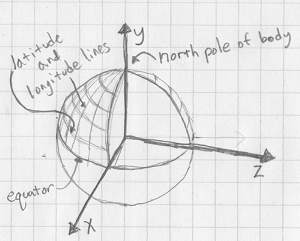
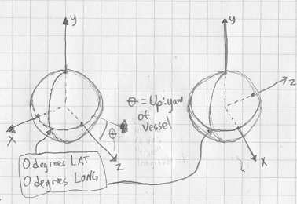

# Reference frames

This page describes the XYZ reference frame used for most of kOS's vectors.

The coordinate system of Kerbal Space Program does some strange things that don't make a lot of sense at first.

For nomenclature, the following terms are used in this documentation:

* SHIP-RAW : The name of the reference frame in which the origin point is [CPU Vessel](../../summary_topics/CPU_vessel/index.html), and the rotation is identical to KSP's native raw coordinate grid.
* SOI-RAW : The name of the reference frame in which the origin point is the center of the SOI body, and the rotation is identical to KSP's native raw coordinate grid.
* RAW-RAW : The name of the reference fraem in which both the origin point and the rotation of the axes is identical to KSP's native raw coordinate grid.  (This is never exposed to the kerbalscript program, because the origin point is meaningless to work with.)

(It is hoped that this may be expanded in the future, and conversion routines provided to let people pick a reference frame that makes sense depending on what the script is trying to do.  At the moment the only reference frames used are SHIP-RAW and SOI-RAW, as they match closely to what KSP is using internally.)

RAW Orienatation
----------------

The Y axis of KSP is the only consistent thing.  Imagine a ray starting in the
center of the SOI body and pointing upward out through the north pole.  That
is the direction of the Y axis.  (If you move to the SOI of a body with an
inclinded spin, presumably it will also change the angle of the Y axis to
point in the new direction of the body's spin axis).

The X and Z axes of the coordinate grid are then consequently aligned with the
equator plane of the SOI body, 90 degrees to each other.  KSP uses a left-handed
coordinate system, so the Z axis will always be rotated 90 degrees to the east of
the X axis.

However, the X and Z axes are hard to predict where they'll exactly be.  They keep
moving depending on where you are, to the point where it's impossible to get a
fix on just which direction they'll point.

Origin position
---------------

The origin position of the XYZ coordinate grid in KSP is also a bit messy.  It's
usually *near* but not exactly *on* the current ship.  kOS performs some
conversions for you to make this a bit simpler and keep everything consistent.

Regardless of where the origin of the underlying KSP system is, in kOS, whenever
a POSITION is reported, it will always be reported in a frame of reference where
the origin is located at the c[CPU Vessel](../../summary_topics/CPU_vessel/index.html).

However, for the sake of VELOCITY, the origin point of all vectors is usually not
SHIP, but rather it's the SOI body's center.  This is because if the origin point
was the SHIP, then the ship's velocity would always be zero in that frame of
reference, and that would not be useful.

The makers of kOS are aware that this is not technically a proper frame of reference,
because the origin point varies depending on if you're getting POSITION or
getting VELOCITY.  Fixing it at this point would break a lot of existing scripts,
however.

So the rule of thumb is:

* For POSITION returned by KSP, the SHIP-RAW reference frame is used: centered on SHIP, with raw axes rotation.
* For VELOCITY returned by KSP, the SOI-RAW reference frame is used: centered on SOI Body, with raw axes rotation.

CONVERTING
----------

Converting between SHIP-RAW and SOI-RAW reference frames is a simple matter of adding or subtracting the SHIP:BODY:POSITION vector from the coordinate, to move the origin point.  This is because both are using the same axes rotation.

* Any SHIP-RAW vector Minus SHIP:BODY:POSITION Gives the vector in SOI-RAW coordinates.
* Any SOI-RAW vector Plus SHIP:BODY:POSITION Gives the vector in SHIP-RAW coordinates.

